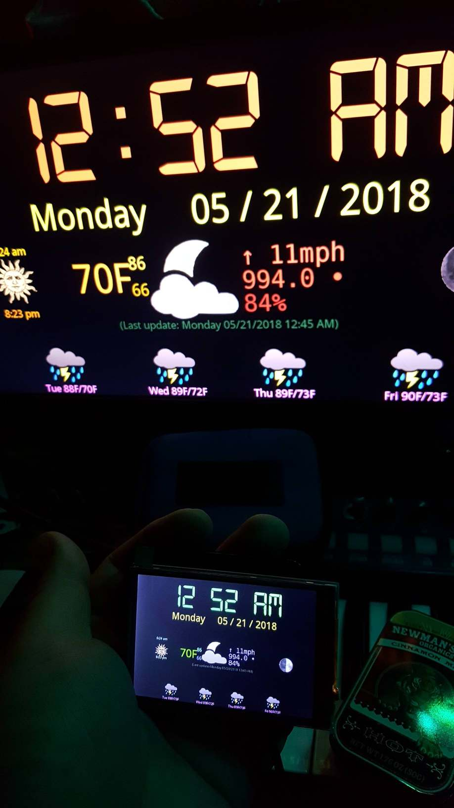

# HyperClock

**Current Version:** 3.0<br>
**Last Update:** 05/26/18<br>
**Author:** level6<br>
**URL:** https://github.com/lleevveell66/HyperClock<br>
This is HyperClock, the customizable clock and weather display of the futuuuurreeee... <br>


## Description:

HyperClock is a Python script running on a Raspberry Pi board showing a simple clock with 
weather and astral information displayed on any HDMI-capable display you want.  It has also 
worked on 3.5" and 7" LCD displays via I2C.  It has been tested to work on RPi B+, 2B, 3B,
Zero W, and Zero WH in Raspbian Wheezy, Jessie, and Stretch.  I am sure it could work on 
any Linux system with Python, Pygame, and graphic capability, though.  The reason I built it 
on RPis with huge HDMI TV displays is because I am as blind as a bat, these days.  I have one 
in almost every room of my house, now.

Weather data is retrieved every 15 minutes over the network from the Yahoo Weather API. The 
time is spoken in a robotic voice, on the hour.  There is support for external temperature s
ensor probes.  Colors and fonts are easily configurable.

## Requirements:
- Raspberry Pi B+, 2B, 3B, ZeroW, ZeroWH
- Raspbian (Wheezy, Jessie, or Stretch)
- Python
- Pygame
- Graphics capability (I have this running on 19" and 32" HDMI TVs and on 3.5 and 7" TFT display via I2C with an external speakers)


<html>
<body>
<p>

</p> 
</body>
</html>

## Installation:
- Download and install your favorite SD Card imager.  I use Win32DiskImager .
- Download and write the latest Raspbian image to the microSD card (don't get any "Lite" version, or pygame will be very difficult to install)
- Insert microSD card and boot the RPi
- CNTL-ALT-F6 and login as pi/raspberry
  - I do this all from CLI, but you can also do it from X11 GUI.
  - I also do everything as root.  Feel free to sudo everything.

```
# Switch User to root:
sudo su -

# Set it to boot into normal textual login, no more X:
systemctl set-default multi-user.target

raspi-config
# change password
# change hostname
# change locale, timezone, wifi country
# enable SSH and 1-wire (if using DS18B20-based temperature probe)
# expand disk
# set up networking 
# reboot

# SSH back in as pi user, and switch user to root
# If you find this annoying, you can allow root SSH login with the following:
# # Allow root user SSH logins (OPTIONAL):
# perl -p -i -e 's/^#PermitRootLogin prohibit-password/PermitRootLogin yes/' /etc/ssh/sshd_config
# service sshd restart
# passwd root

# Install some required packages and update everything:
apt-get install ntp ntpdate git python-pip python3-pip
apt-get -y upgrade
apt-get update

# Disable IPv6 (OPTIONAL):
cat <<'EOF'>/etc/sysctl.conf
net.ipv6.conf.all.disable_ipv6=1
net.ipv6.conf.default.disable_ipv6=1
EOF
sysctl -p

# Get NTP working:
service ntp stop
ntpdate 0.pool.ntp.org 1.pool.ntp.org 2.pool.ntp.org
service ntp start
update-rc.d ntp enable
date
ntpq -p

# Install pygame for python and python3 (you can do this only for python, if you like):
pip install pygame
pip3 install pygame
pip install setuptools
pip3 install setuptools

# Clean-up unused packages
apt-get autoremove -y

# Install HyperClock from git repo:
cd /usr/local/src
git clone https://github.com/lleevveell66/HyperClock
cd HyperClock
./install.sh

# Customize (decribed below):
vi /usr/local/HyperClock/HyperClock.conf
# pay special attention to: topology, woeid

# Test it out:
/usr/local/HyperClock/HyperClock  # Hit CTRL-C to stop

# Make it run HyperClock on boot:
vi /etc/rc.local
.
.
# Uncomment and edit these for your chosen indoor temperature solution (described below): 
#printf "Getting the initial indoor temp reading ...\n"
#/usr/local/HyperClock/extras/IndoorTemp > /usr/local/HyperClock/CurrentIndoorTemp

printf "HyperClock: Starting HyperClock ...\n"
sudo /usr/local/HyperClock/HyperClock &
.
.

# Reboot to test it out:
shutdown -r now

``` 

## Customization:

There are several customizable pieces of HyperClock:

### Fonts:

To change fonts displayed in HyperClock, edit the /usr/local/HyperClock/HyperClock.conf file and change the font lines to 
correspond to your font locations.

```
# Font locations
timefont = /usr/local/HyperClock/fonts/digital-7-mono.ttf
datefont = /usr/local/HyperClock/fonts/DroidSans.ttf
weatherfont = /usr/local/HyperClock/fonts/DroidSans.ttf
tempfont = /usr/local/HyperClock/fonts/DroidSans.ttf
itempfont = /usr/local/HyperClock/fonts/DroidSans.ttf
highfont = /usr/local/HyperClock/fonts/DroidSans.ttf
lowfont = /usr/local/HyperClock/fonts/DroidSans.ttf
forecastfont = /usr/local/HyperClock/fonts/DroidSans.ttf
windfont = /usr/local/HyperClock/fonts/DejaVuSansMono.ttf
pressurefont = /usr/local/HyperClock/fonts/DroidSans.ttf
humidityfont = /usr/local/HyperClock/fonts/DroidSans.ttf
sunrisesetfont = /usr/local/HyperClock/fonts/DroidSans.ttf
lastfont = /usr/local/HyperClock/fonts/DroidSans.ttf
```

### Colors:

To change the colors of HyperClock text, edit the /usr/local/HyperClock/HyperClock.conf file and change the color lines with your preferred Red, Green, Blue values.

```
# Colors in Red, Green, Blue
timecolor = 64,255,64
datecolor = 240,240,30
weathercolor = 255,255,128
tempcolor = 80,255,0
itempcolor = 240,170,60
highcolor = 65,235,180
lowcolor = 70,130,255
windcolor = 128,128,255
pressurecolor = 128,128,255
humiditycolor = 128,128,255
day1color = 255,128,255
day2color = 255,128,255
day3color = 255,128,255
day4color = 255,128,255
sunrisecolor = 128,255,255
sunsetcolor = 128,255,255
lastcolor = 50,89,58
```

Several pre-built "themes" are included in the /usr/local/HyperClock/themes/ directory.  These include only 
the color section values. You can use those values in your own HyperClock.conf file.

### Topology and Weather Retreival:

There are two methods of weather data retrieval:

#### Standalone:

This is the default method of weather and astral data retrieval.  The *topology* parameter is set to *standalone* in the HyperClock.conf file for this method.  Every 15 minutes (900 seconds), HyperClock will use built-in code to retrieve the data 
from the Yahoo! Weather API.  This is fine for a single HyperClock, but when running multiple HyperClocks, please try to use a networked topology, as described below.

#### Networked:

This method is slightly more complicated.  It is important to think about using this method of data retrieval when running more than a single HyperClock, as it will create much less traffic to the Yahoo! Weather API, which has remained free, to date, but... who knows, once they begin to get tens of thousands of requests per site, per day.  

The *topology* parameter is set to *networked* in the HyperClock.conf file for this method.  HyperClock will use the script defined in *AstralDataCommand* to retrieve the XML file of data, ideally gathered once every 15 minutes on a central site (a web server on your LAN is easiest.)

Your script must create the file defined in *AstralDataFile* as an XML file following this format:

```
<?xml version="1.0" ?>
  <data>
    <now date="Tuesday 07/12/2016" time="05:30 PM"/>
    <astral moonphase="First Quarter" moonphasenum="2" sunrise="6:28 am" sunset="8:37 pm"/>
    <weather>
      <current code="23" condition="Breezy" humidity="44" indoor="NA" pressure="989.0" rising="0" setting="NA" temp="95" windchill="95" winddirection="180" windspeed="29"/>
      <forecast>
        <day0 code="23" condition="Breezy" date="12 Jul 2016" day="Tue" high="91" low="77" precip="100"/>
        <day1 code="23" condition="Breezy" date="13 Jul 2016" day="Wed" high="94" low="77" precip="100"/>
        <day2 code="34" condition="Mostly Sunny" date="14 Jul 2016" day="Thu" high="95" low="78" precip="100"/>
        <day3 code="4" condition="Thunderstorms" date="15 Jul 2016" day="Fri" high="93" low="79" precip="100"/>
        <day4 code="47" condition="Scattered Thunderstorms" date="16 Jul 2016" day="Sat" high="92" low="78" precip="100"/>
      </forecast>
    </weather>
  </data>
```

A sample script which retreives the data on my own network is included in the /usr/local/HyperClock/GetWeather.sh file.  You will notice a sanity check in this script.  This is important in case the central script skips a beat and cannot retreive the data.  HyperClock will remain running, but just display older data.  

### Indoor Temperature Retreival:

There are three (3) included settings for HyperClock to retrieve an indoor temperature:

#### Honeywell Wifi Thermostat (via My Total Connect):

You will find code in the included *GetIndoorTemp.sh* script (which has been commented out) which will retrieve this data from a Honeywell thermostat.  Change the *USERNAME*, *PASSWORD*, and *DEVICEID* lines to match your account on MyTotalConnect, and uncomment these lines and everything should work.

```
# Use this for a WiFi Honeywell thermostat via My Total Connect

USERNAME=CHANGEME@CHANGEME.CH
PASSWORD=CHANGEME
DEVICEID=CHANGME
extras/therm.py -U $USERNAME -P $PASSWORD -D $DEVICEID -q | grep ^CurrentTemp|cut -d\  -f2|sed 's/\..*//'>/usr/local/HyperClock/CurrentIndoorTemp
```

This method uses the extras/therm.py script written by Brad Goodman.  I made a few changes to make it work with the newer MyTotalConnect web site.  

#### DS18B20-Based Temperature Probe

You will find code in the included *GetIndoorTemp.sh* script (which has been commented out) which will retrieve this data from a DS18B20-based temperature probe, via 1-wire on the GPIO pins.

```
# Use this for a DS18B20 type of probe
# (https://www.amazon.com/gp/product/B00Q9YBIJI/ref=oh_aui_detailpage_o06_s01?ie=UTF8&psc=1)

extras/IndoorTemp > /usr/local/HyperClock/CurrentIndoorTemp
```

This method uses my own extras/IndoorTemp script, based closely on *find this original author's name* script.

I have the DS18B20 attached to the RPi as follows: 
- Red -> Pin 4 (5V)
- Black -> Pin 6 (GND)
- Blue -> Pin 7 (GPIO 4)

#### No Indoor Temperature Data

If the script defined in *IndoorTempCommand* writes a **9999** into the file defined in *IndoorTempFile*, then HyperClock assumes that there is no indoor temperature capability, and omits displaying this data on the screen.  This is the default for the released code, as many more people will not have a valid method for indoor temperature sensing, right off, than will.

#### BONUS Method:

Build, buy, and/or write your own!  It's fun!   If you do this, I would humbly request that you branch the code and include your magic.  If you are not git-savvy, simply send me an email with a description and include the code you used.


